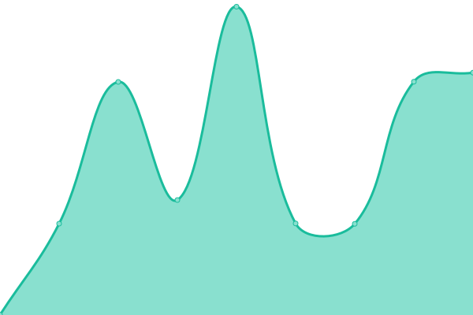

# [📈 Live Status](https://jg3hlx.github.io/upptime): <!--live status--> **🟩 All systems operational**

This repository contains the open-source uptime monitor and status page for [jg3hlx](https://jg3hlx.github.io/upptime), powered by [Upptime](https://github.com/upptime/upptime).

With [Upptime](https://upptime.js.org), you can get your own unlimited and free uptime monitor and status page, powered entirely by a GitHub repository. We use [Issues](https://github.com/jg3hlx/upptime/issues) as incident reports, [Actions](https://github.com/jg3hlx/upptime/actions) as uptime monitors, and [Pages](https://jg3hlx.github.io/upptime) for the status page.

<!--start: status pages-->
<!-- This summary is generated by Upptime (https://github.com/upptime/upptime) -->
<!-- Do not edit this manually, your changes will be overwritten -->
<!-- prettier-ignore -->
| URL | Status | History | Response Time | Uptime |
| --- | ------ | ------- | ------------- | ------ |
|  [XLX016](http://xrf016.xreflector-jp.org) | 🟩 Up | [xlx-016.yml](https://github.com/jg3hlx/upptime/commits/master/history/xlx-016.yml) | 

 1603ms
     
 | 

<a href="https://jg3hlx.github.io/upptime/history/xlx-016">99.41%</a>
    

|  [XLX052](http://xrf052.xreflector-jp.org) | 🟩 Up | [xlx-052.yml](https://github.com/jg3hlx/upptime/commits/master/history/xlx-052.yml) | 

 1380ms
     
 | 

<a href="https://jg3hlx.github.io/upptime/history/xlx-052">99.41%</a>
    

|  [XLX058](http://xrf058.xreflector-jp.org) | 🟩 Up | [xlx-058.yml](https://github.com/jg3hlx/upptime/commits/master/history/xlx-058.yml) | 

 1372ms
     
 | 

<a href="https://jg3hlx.github.io/upptime/history/xlx-058">99.42%</a>
    

|  [XLX064](http://xrf064.owari.biz) | 🟩 Up | [xlx-064.yml](https://github.com/jg3hlx/upptime/commits/master/history/xlx-064.yml) | 

 4544ms
     
 | 

<a href="https://jg3hlx.github.io/upptime/history/xlx-064">100.00%</a>
    

|  [XLX076](http://xrf076.xreflector-jp.org) | 🟩 Up | [xlx-076.yml](https://github.com/jg3hlx/upptime/commits/master/history/xlx-076.yml) | 

 766ms
     
 | 

<a href="https://jg3hlx.github.io/upptime/history/xlx-076">100.00%</a>
    

|  [XLX081](http://xrf081.mydns.jp) | 🟩 Up | [xlx-081.yml](https://github.com/jg3hlx/upptime/commits/master/history/xlx-081.yml) | 

 1887ms
     
 | 

<a href="https://jg3hlx.github.io/upptime/history/xlx-081">99.43%</a>
    

|  [XLX085](http://xrf085.mydns.jp) | 🟩 Up | [xlx-085.yml](https://github.com/jg3hlx/upptime/commits/master/history/xlx-085.yml) | 

 1035ms
     
 | 

<a href="https://jg3hlx.github.io/upptime/history/xlx-085">100.00%</a>
    

|  [XLX095](http://xrf095.xreflector-jp.org) | 🟩 Up | [xlx-095.yml](https://github.com/jg3hlx/upptime/commits/master/history/xlx-095.yml) | 

 992ms
     
 | 

<a href="https://jg3hlx.github.io/upptime/history/xlx-095">100.00%</a>
    

|  [XLX098](http://xrf098.mydns.jp) | 🟩 Up | [xlx-098.yml](https://github.com/jg3hlx/upptime/commits/master/history/xlx-098.yml) | 

 1493ms
     
 | 

<a href="https://jg3hlx.github.io/upptime/history/xlx-098">100.00%</a>
    

|  [XLX111](http://xrf111.xreflector-jp.org) | 🟩 Up | [xlx-111.yml](https://github.com/jg3hlx/upptime/commits/master/history/xlx-111.yml) | 

 1150ms
     
 | 

<a href="https://jg3hlx.github.io/upptime/history/xlx-111">99.43%</a>
    

|  [XLX124](http://xrf124.xreflector-jp.org) | 🟩 Up | [xlx-124.yml](https://github.com/jg3hlx/upptime/commits/master/history/xlx-124.yml) | 

 769ms
     
 | 

<a href="https://jg3hlx.github.io/upptime/history/xlx-124">100.00%</a>
    

|  [XLX129](http://guwgw.cir-ins.com) | 🟩 Up | [xlx-129.yml](https://github.com/jg3hlx/upptime/commits/master/history/xlx-129.yml) | 

 7578ms
     
 | 

<a href="https://jg3hlx.github.io/upptime/history/xlx-129">91.78%</a>
    

|  [XLX176](http://xrf176.xreflector-jp.org) | 🟩 Up | [xlx-176.yml](https://github.com/jg3hlx/upptime/commits/master/history/xlx-176.yml) | 

 610ms
     
 | 

<a href="https://jg3hlx.github.io/upptime/history/xlx-176">99.43%</a>
    

|  [XLX220](http://xlx220.sapotech.com) | 🟩 Up | [xlx-220.yml](https://github.com/jg3hlx/upptime/commits/master/history/xlx-220.yml) | 

 1780ms
     
 | 

<a href="https://jg3hlx.github.io/upptime/history/xlx-220">100.00%</a>
    

|  [XLX224](http://xrf224.xreflector-jp.org) | 🟩 Up | [xlx-224.yml](https://github.com/jg3hlx/upptime/commits/master/history/xlx-224.yml) | 

 638ms
     
 | 

<a href="https://jg3hlx.github.io/upptime/history/xlx-224">100.00%</a>
    

|  [XLX225](http://xrf225.xreflector-jp.org) | 🟩 Up | [xlx-225.yml](https://github.com/jg3hlx/upptime/commits/master/history/xlx-225.yml) | 

 653ms
     
 | 

<a href="https://jg3hlx.github.io/upptime/history/xlx-225">99.44%</a>
    

|  [XLX291](http://xrf291.xreflector-jp.org) | 🟩 Up | [xlx-291.yml](https://github.com/jg3hlx/upptime/commits/master/history/xlx-291.yml) | 

 1361ms
     
 | 

<a href="https://jg3hlx.github.io/upptime/history/xlx-291">99.44%</a>
    

|  [XLX326](http://xrf326.xreflector-jp.org) | 🟩 Up | [xlx-326.yml](https://github.com/jg3hlx/upptime/commits/master/history/xlx-326.yml) | 

 1437ms
     
 | 

<a href="https://jg3hlx.github.io/upptime/history/xlx-326">99.45%</a>
    

|  [XLX360](http://xrf360.xreflector-jp.org) | 🟩 Up | [xlx-360.yml](https://github.com/jg3hlx/upptime/commits/master/history/xlx-360.yml) | 

 1174ms
     
 | 

<a href="https://jg3hlx.github.io/upptime/history/xlx-360">99.45%</a>
    

|  [XLX373](http://xrf373.mydns.jp) | 🟩 Up | [xlx-373.yml](https://github.com/jg3hlx/upptime/commits/master/history/xlx-373.yml) | 

 1398ms
     
 | 

<a href="https://jg3hlx.github.io/upptime/history/xlx-373">99.46%</a>
    

|  [XLX380](http://kdk.ddns.net) | 🟩 Up | [xlx-380.yml](https://github.com/jg3hlx/upptime/commits/master/history/xlx-380.yml) | 

 698ms
     
 | 

<a href="https://jg3hlx.github.io/upptime/history/xlx-380">100.00%</a>
    

|  [XLX412](http://xrf412.xreflector-jp.org) | 🟩 Up | [xlx-412.yml](https://github.com/jg3hlx/upptime/commits/master/history/xlx-412.yml) | 

 636ms
     
 | 

<a href="https://jg3hlx.github.io/upptime/history/xlx-412">99.46%</a>
    

|  [XLX431](http://xrf431.xreflector-jp.org) | 🟩 Up | [xlx-431.yml](https://github.com/jg3hlx/upptime/commits/master/history/xlx-431.yml) | 

 602ms
     
 | 

<a href="https://jg3hlx.github.io/upptime/history/xlx-431">99.47%</a>
    

|  [XLX435](http://xrf435.xreflector-jp.org) | 🟩 Up | [xlx-435.yml](https://github.com/jg3hlx/upptime/commits/master/history/xlx-435.yml) | 

 1349ms
     
 | 

<a href="https://jg3hlx.github.io/upptime/history/xlx-435">99.47%</a>
    

|  [XLX440](http://xrf440.e-kyushu.net) | 🟩 Up | [xlx-440.yml](https://github.com/jg3hlx/upptime/commits/master/history/xlx-440.yml) | 

 1112ms
     
 | 

<a href="https://jg3hlx.github.io/upptime/history/xlx-440">100.00%</a>
    

|  [XLX441](http://xrf441.xreflector-jp.org) | 🟩 Up | [xlx-441.yml](https://github.com/jg3hlx/upptime/commits/master/history/xlx-441.yml) | 

 1151ms
     
 | 

<a href="https://jg3hlx.github.io/upptime/history/xlx-441">100.00%</a>
    

|  [XLX459](http://xrf459.xreflector-jp.org) | 🟩 Up | [xlx-459.yml](https://github.com/jg3hlx/upptime/commits/master/history/xlx-459.yml) | 

 701ms
     
 | 

<a href="https://jg3hlx.github.io/upptime/history/xlx-459">99.48%</a>
    

|  [XLX464](http://ah-huh.net/xlx/) | 🟩 Up | [xlx-464.yml](https://github.com/jg3hlx/upptime/commits/master/history/xlx-464.yml) | 

 788ms
     
 | 

<a href="https://jg3hlx.github.io/upptime/history/xlx-464">100.00%</a>
    

|  [XLX499](http://xrf499.xreflector-jp.org) | 🟩 Up | [xlx-499.yml](https://github.com/jg3hlx/upptime/commits/master/history/xlx-499.yml) | 

 1010ms
     
 | 

<a href="https://jg3hlx.github.io/upptime/history/xlx-499">100.00%</a>
    

|  [XLX510](http://xrf510.xreflector-jp.org) | 🟩 Up | [xlx-510.yml](https://github.com/jg3hlx/upptime/commits/master/history/xlx-510.yml) | 

 840ms
     
 | 

<a href="https://jg3hlx.github.io/upptime/history/xlx-510">99.48%</a>
    

|  [XLX514](http://xrf514.xreflector-jp.org) | 🟩 Up | [xlx-514.yml](https://github.com/jg3hlx/upptime/commits/master/history/xlx-514.yml) | 

 577ms
     
 | 

<a href="https://jg3hlx.github.io/upptime/history/xlx-514">100.00%</a>
    

|  [XLX515](http://xrf515.xreflector-jp.org) | 🟩 Up | [xlx-515.yml](https://github.com/jg3hlx/upptime/commits/master/history/xlx-515.yml) | 

 1175ms
     
 | 

<a href="https://jg3hlx.github.io/upptime/history/xlx-515">100.00%</a>
    

|  [XLX538](http://xrf538.mydns.jp) | 🟩 Up | [xlx-538.yml](https://github.com/jg3hlx/upptime/commits/master/history/xlx-538.yml) | 

 1393ms
     
 | 

<a href="https://jg3hlx.github.io/upptime/history/xlx-538">100.00%</a>
    

|  [XLX560](http://xrf560.xreflector-jp.org) | 🟩 Up | [xlx-560.yml](https://github.com/jg3hlx/upptime/commits/master/history/xlx-560.yml) | 

 749ms
     
 | 

<a href="https://jg3hlx.github.io/upptime/history/xlx-560">99.49%</a>
    

|  [XLX583](http://xrf583.mydns.jp) | 🟩 Up | [xlx-583.yml](https://github.com/jg3hlx/upptime/commits/master/history/xlx-583.yml) | 

 1183ms
     
 | 

<a href="https://jg3hlx.github.io/upptime/history/xlx-583">100.00%</a>
    

|  [XLX599](http://xrf599.xreflector-jp.org) | 🟩 Up | [xlx-599.yml](https://github.com/jg3hlx/upptime/commits/master/history/xlx-599.yml) | 

 1235ms
     
 | 

<a href="https://jg3hlx.github.io/upptime/history/xlx-599">99.49%</a>
    

|  [XLX608](http://xrf608.xreflector-jp.org) | 🟩 Up | [xlx-608.yml](https://github.com/jg3hlx/upptime/commits/master/history/xlx-608.yml) | 

 1137ms
     
 | 

<a href="https://jg3hlx.github.io/upptime/history/xlx-608">99.50%</a>
    

|  [XLX630](http://xrf630.xreflector-jp.org) | 🟩 Up | [xlx-630.yml](https://github.com/jg3hlx/upptime/commits/master/history/xlx-630.yml) | 

 965ms
     
 | 

<a href="https://jg3hlx.github.io/upptime/history/xlx-630">99.51%</a>
    

|  [XLX673](http://xrf673.xreflector-jp.org) | 🟩 Up | [xlx-673.yml](https://github.com/jg3hlx/upptime/commits/master/history/xlx-673.yml) | 

 611ms
     
 | 

<a href="https://jg3hlx.github.io/upptime/history/xlx-673">99.51%</a>
    

|  [XLX698](http://xrf698.xreflector-jp.org) | 🟩 Up | [xlx-698.yml](https://github.com/jg3hlx/upptime/commits/master/history/xlx-698.yml) | 

 1173ms
     
 | 

<a href="https://jg3hlx.github.io/upptime/history/xlx-698">100.00%</a>
    

|  [XLX701](http://xrf701.xreflector-jp.org) | 🟩 Up | [xlx-701.yml](https://github.com/jg3hlx/upptime/commits/master/history/xlx-701.yml) | 

 1452ms
     
 | 

<a href="https://jg3hlx.github.io/upptime/history/xlx-701">99.52%</a>
    

|  [XLX703](http://xrf703.xreflector-jp.org) | 🟩 Up | [xlx-703.yml](https://github.com/jg3hlx/upptime/commits/master/history/xlx-703.yml) | 

 1059ms
     
 | 

<a href="https://jg3hlx.github.io/upptime/history/xlx-703">99.52%</a>
    

|  [XLX704](http://xrf704.xreflector-jp.org) | 🟩 Up | [xlx-704.yml](https://github.com/jg3hlx/upptime/commits/master/history/xlx-704.yml) | 

 1069ms
     
 | 

<a href="https://jg3hlx.github.io/upptime/history/xlx-704">99.53%</a>
    

|  [XLX705](http://xrf705.xreflector-jp.org) | 🟩 Up | [xlx-705.yml](https://github.com/jg3hlx/upptime/commits/master/history/xlx-705.yml) | 

 703ms
     
 | 

<a href="https://jg3hlx.github.io/upptime/history/xlx-705">99.53%</a>
    

|  [XLX708](http://xrf708.xreflector-jp.org) | 🟩 Up | [xlx-708.yml](https://github.com/jg3hlx/upptime/commits/master/history/xlx-708.yml) | 

 1081ms
     
 | 

<a href="https://jg3hlx.github.io/upptime/history/xlx-708">99.54%</a>
    

|  [XLX712](http://xrf712.mydns.jp) | 🟩 Up | [xlx-712.yml](https://github.com/jg3hlx/upptime/commits/master/history/xlx-712.yml) | 

 1721ms
     
 | 

<a href="https://jg3hlx.github.io/upptime/history/xlx-712">100.00%</a>
    

|  [XLX713](http://xrf713.xreflector-jp.org) | 🟩 Up | [xlx-713.yml](https://github.com/jg3hlx/upptime/commits/master/history/xlx-713.yml) | 

 612ms
     
 | 

<a href="https://jg3hlx.github.io/upptime/history/xlx-713">99.54%</a>
    

|  [XLX741](http://xrf741.xreflector-jp.org) | 🟩 Up | [xlx-741.yml](https://github.com/jg3hlx/upptime/commits/master/history/xlx-741.yml) | 

 1005ms
     
 | 

<a href="https://jg3hlx.github.io/upptime/history/xlx-741">100.00%</a>
    

|  [XLX738](http://xlx738.jq2sai.net) | 🟩 Up | [xlx-738.yml](https://github.com/jg3hlx/upptime/commits/master/history/xlx-738.yml) | 

 933ms
     
 | 

<a href="https://jg3hlx.github.io/upptime/history/xlx-738">100.00%</a>
    

|  [XLX753](http://xrf753.xreflector-jp.org) | 🟩 Up | [xlx-753.yml](https://github.com/jg3hlx/upptime/commits/master/history/xlx-753.yml) | 

 1132ms
     
 | 

<a href="https://jg3hlx.github.io/upptime/history/xlx-753">100.00%</a>
    

|  [XLX770](http://xrf770.mydns.jp) | 🟩 Up | [xlx-770.yml](https://github.com/jg3hlx/upptime/commits/master/history/xlx-770.yml) | 

 929ms
     
 | 

<a href="https://jg3hlx.github.io/upptime/history/xlx-770">100.00%</a>
    

|  [XLX776](http://776.bayfm78.tokyo) | 🟩 Up | [xlx-776.yml](https://github.com/jg3hlx/upptime/commits/master/history/xlx-776.yml) | 

 1055ms
     
 | 

<a href="https://jg3hlx.github.io/upptime/history/xlx-776">100.00%</a>
    

|  [XLX781](http://xrf781.xreflector-jp.org) | 🟩 Up | [xlx-781.yml](https://github.com/jg3hlx/upptime/commits/master/history/xlx-781.yml) | 

 624ms
     
 | 

<a href="https://jg3hlx.github.io/upptime/history/xlx-781">99.55%</a>
    

|  [XLX794](http://xrf794.xreflector-jp.org) | 🟩 Up | [xlx-794.yml](https://github.com/jg3hlx/upptime/commits/master/history/xlx-794.yml) | 

 882ms
     
 | 

<a href="https://jg3hlx.github.io/upptime/history/xlx-794">99.22%</a>
    

|  [XLX807](http://xrf807.owari.biz) | 🟩 Up | [xlx-807.yml](https://github.com/jg3hlx/upptime/commits/master/history/xlx-807.yml) | 

 2578ms
     
 | 

<a href="https://jg3hlx.github.io/upptime/history/xlx-807">100.00%</a>
    

|  [XLX812](http://xrf812.xreflector-jp.org) | 🟩 Up | [xlx-812.yml](https://github.com/jg3hlx/upptime/commits/master/history/xlx-812.yml) | 

 567ms
     
 | 

<a href="https://jg3hlx.github.io/upptime/history/xlx-812">100.00%</a>
    

|  [XLX878](http://xrf878.xreflector-jp.org) | 🟩 Up | [xlx-878.yml](https://github.com/jg3hlx/upptime/commits/master/history/xlx-878.yml) | 

 1168ms
     
 | 

<a href="https://jg3hlx.github.io/upptime/history/xlx-878">100.00%</a>
    

|  [XLX883](http://xrf883.mydns.jp) | 🟩 Up | [xlx-883.yml](https://github.com/jg3hlx/upptime/commits/master/history/xlx-883.yml) | 

 811ms
     
 | 

<a href="https://jg3hlx.github.io/upptime/history/xlx-883">100.00%</a>
    

|  [XLX904](http://xrf904.xreflector-jp.org) | 🟩 Up | [xlx-904.yml](https://github.com/jg3hlx/upptime/commits/master/history/xlx-904.yml) | 

 797ms
     
 | 

<a href="https://jg3hlx.github.io/upptime/history/xlx-904">99.56%</a>
    

|  [XLX940](http://xrf940.xreflector-jp.org) | 🟩 Up | [xlx-940.yml](https://github.com/jg3hlx/upptime/commits/master/history/xlx-940.yml) | 

 1120ms
     
 | 

<a href="https://jg3hlx.github.io/upptime/history/xlx-940">100.00%</a>
    

|  [XLX944](http://xrf944.xreflector-jp.org) | 🟩 Up | [xlx-944.yml](https://github.com/jg3hlx/upptime/commits/master/history/xlx-944.yml) | 

 571ms
     
 | 

<a href="https://jg3hlx.github.io/upptime/history/xlx-944">100.00%</a>
    

|  [XLX959](http://xrf959.xreflector-jp.org) | 🟩 Up | [xlx-959.yml](https://github.com/jg3hlx/upptime/commits/master/history/xlx-959.yml) | 

 550ms
     
 | 

<a href="https://jg3hlx.github.io/upptime/history/xlx-959">100.00%</a>
    

|  [XLX970](http://xlx970.onogoro.net) | 🟩 Up | [xlx-970.yml](https://github.com/jg3hlx/upptime/commits/master/history/xlx-970.yml) | 

 1480ms
     
 | 

<a href="https://jg3hlx.github.io/upptime/history/xlx-970">100.00%</a>
    

|  [XLX992](http://xrf992.xreflector-jp.org) | 🟩 Up | [xlx-992.yml](https://github.com/jg3hlx/upptime/commits/master/history/xlx-992.yml) | 

 711ms
     
 | 

<a href="https://jg3hlx.github.io/upptime/history/xlx-992">99.56%</a>
    

<!--end: status pages-->

[**Visit our status website →**](https://jg3hlx.github.io/upptime)

## 📄 License

- Powered by: [Upptime](https://github.com/upptime/upptime)
- Code: [MIT](./LICENSE) © [jg3hlx](https://jg3hlx.github.io/upptime)
- Data in the `./history` directory: [Open Database License](https://opendatacommons.org/licenses/odbl/1-0/)
